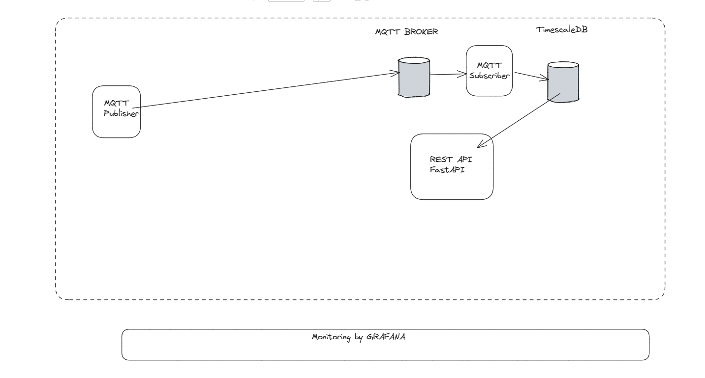

# test_data-monitoring-system

## Αρχιτεκτονική 
συλλογή μετρήσεων απο αισθητήρες με MQTT ,  αποθήκευση σε TimescaleDB και ανάκτηση τους μεσω FastAPI 

├── docker-compose.yml
├── publisher/
│   ├── publisher.py

Publishers(1-3) (αισθητήρες) → Mosquitto broker (διακινηση mqtt messages) → Subscriber (παραλήπτης , λαμβανει και καταγραφει messages στην database) → Database 

## Τρέχον Στάδιο
26/02/2026 Ολοκληρωθηκε το `docker-compose.yml` 

27/02/2026 MQTT Publisher , `implemented publisher.py` με paho-mqtt library 2.0 version (https://www.emqx.com/en/blog/how-to-use-mqtt-in-python#auto-reconnect)
    -json payload (device_name, timestamp{ISO 8601 UTC})