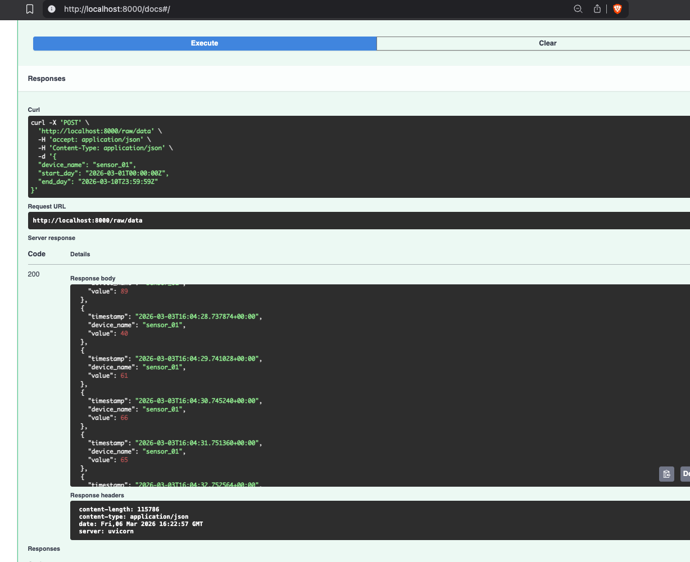

# IoT Monitoring System 
MQTT-based Sensor Monitoring System with TimescaleDB

## Architecture 
Collection of sensor measurements with MQTT, storage in TimescaleDB, and retrieval through FastAPI. CPU and RAM metrics tracking with Grafana.

**Data Flow :**


* **MQTT Broker:** Using [Eclipse Mosquitto](https://hub.docker.com/_/eclipse-mosquitto) via Docker for message handling.
* **MQTT Clients (Publishers/Subscriber):** Developed in Python 3.11 with `paho-mqtt` library, [EMQX Guide](https://www.emqx.com/en/blog/how-to-use-mqtt-in-python).
* **Database:** [TimescaleDB](https://www.tigerdata.com/docs/self-hosted/latest/install/installation-docker) 
* **REST API:** Built with [FastAPI](https://fastapi.tiangolo.com/) , it has 2 endpoints :
    * **/raw/data** returns raw data of sensor records.
    * **/sum/data** returns sum of those values.
* **Monitoring:** Track CPU and RAM metrics of all containers in real time. cAdvisor collects container metrics , Prometheus saves them and Grafana handles the visualization

## How to Run
1. **Clone the repo :**
```bash
git clone https://github.com/StefanosMiliotis/test_data-monitoring-system.git
cd test_data-monitoring-system
```
2. **Start the system with Docker Compose :**
```bash
docker-compose up --build -d
```
3. **Access API :**

Once containers are up , open the following in your browser : 
* **Swagger UI: http://localhost:8000/docs**
* **Redoc: http://localhost:8000/redoc**

* **API Usage Example**
    1. Open Swagger UI.

    2. Expand the POST /raw/data or POST /sum/data endpoint.

    3. Click "Try it out".

    4. Paste the following JSON into the Request Body:
        ```json
        {
        "device_name": "sensor_01",
        "start_day": "2026-03-01T00:00:00Z",
        "end_day": "2026-03-10T23:59:59Z"
        }
        ```
    5. Click "Execute" to view the response from the database.



4. **Access Grafana Monitoring :**

Open the following in your browser : 
* **http://localhost:3000**
    * username : admin
    * password : admin


## Current Stage 

**26/02/2026**
* **Completed `docker-compose.yml`**

**27/02/2026 MQTT Publisher**
* implemented **`publisher.py`** with paho-mqtt library 2.0 version [EMQX Guide](https://www.emqx.com/en/blog/how-to-use-mqtt-in-python)
* json payload (device_name, timestamp{ISO 8601 UTC})

**28/02/2026 Completion of `publisher.py`**

**01/03/2026 Dockerfile for publisher & subscriber**

**03/03/2026 Backend Completion**
* **-update `mosquitto.conf`**
* **-update `publishers.py`**
* **-add & complete `subscribers.py`**
* **-database setup: creation of sensors_data table and conversion to hypertable** [TimescaleDB](https://www.tigerdata.com/docs/self-hosted/latest/install/installation-docker)
* **-fixed bugs :**
    * **Connection Refused (Mosquitto)**
        broker was rejecting connections, solved via `mosquitto.conf`
    * **Container Race Condition**
        python scripts were starting before mosquitto broker loaded, solved with try...except + time.sleep(2)
    * **Paho-MQTT v2 Compatibility**
        problem with on_connect parameters, solved with CallbackAPIVersion.VERSION2 and properties=None of the subscriber
    * **SQL Insert Data Mismatch**
        sql query in the subscriber was using NOW() from database instead of timestamp from sensor JSON

**06/03/2026 Rest API Implementation**

**07/03/2026 Grafana Implementation**
* Built a custom dashboard with the following queries : 
    * `rate(container_cpu_usage_seconds_total[1m])`
    * `container_memory_usage_bytes`