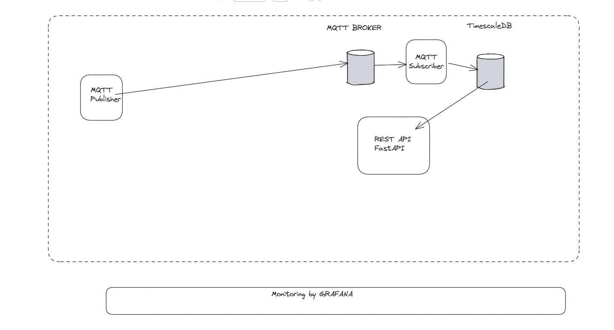

# test_data-monitoring-system

## Αρχιτεκτονική 
συλλογή μετρήσεων απο αισθητήρες με MQTT ,  αποθήκευση σε TimescaleDB και ανάκτηση τους μεσω FastAPI 

Publishers(1-3) (αισθητήρες) → Mosquitto broker (διακινηση mqtt messages) → Subscriber (παραλήπτης , λαμβανει και καταγραφει messages στην database) → Database 

* **MQTT Broker:** Χρήση του [Eclipse Mosquitto](https://hub.docker.com/_/eclipse-mosquitto) μέσω Docker για τη διακίνηση των μηνυμάτων.
* **MQTT Clients (Publishers/Subscriber):** Ανάπτυξη σε Python 3.11 με τη βιβλιοθήκη `paho-mqtt`, [EMQX Guide](https://www.emqx.com/en/blog/how-to-use-mqtt-in-python).
* **Database:** [TimescaleDB](https://www.tigerdata.com/docs/self-hosted/latest/install/installation-docker) 
## Τρέχον Στάδιο

**26/02/2026**
* **Ολοκληρωθηκε το `docker-compose.yml`**

**27/02/2026 MQTT Publisher**
* implemented `publisher.py` με paho-mqtt library 2.0 version [EMQX Guide](https://www.emqx.com/en/blog/how-to-use-mqtt-in-python)
* -json payload (device_name, timestamp{ISO 8601 UTC})

**28/02/2026 Ολοκλήρωση publisher.py**

**01/03/2026 Dockerfile for publisher & subscriber**

**03/03/2026 Ολοκλήρωση backend**
* **-update mosquitto.conf**
* **-update publishers.py**
* **-add & complete subscribers.py**
* **-database setup: δημιουργία πίνακα sensors_data και μετατροπή σε hypertable**[TimescaleDB](https://www.tigerdata.com/docs/self-hosted/latest/install/installation-docker)
* **-fixed bugs :**
    * **Connection Refused (Mosquitto)**
        broker απερριπτε συνδεσεις, λυθηκε μεσω mosquitto.conf
    * **Container Race Condition**
        python scripts ξεκιναγαν πριν φορτωσει ο mosquitto broker, λυθηκε με try...except + time.sleep(2)
    * **Paho-MQTT v2 Compatibility**
        προβλημα με παραμετρους της on_connect , λυθηκε με CallbackAPIVersion.VERSION2 και properties=None του subscriber
    * **SQL Insert Data Mismatch**
        sql query στον subscriber χρησιμοποιουσε NOW() της βασης αντί timestamp απο JSON του sensor